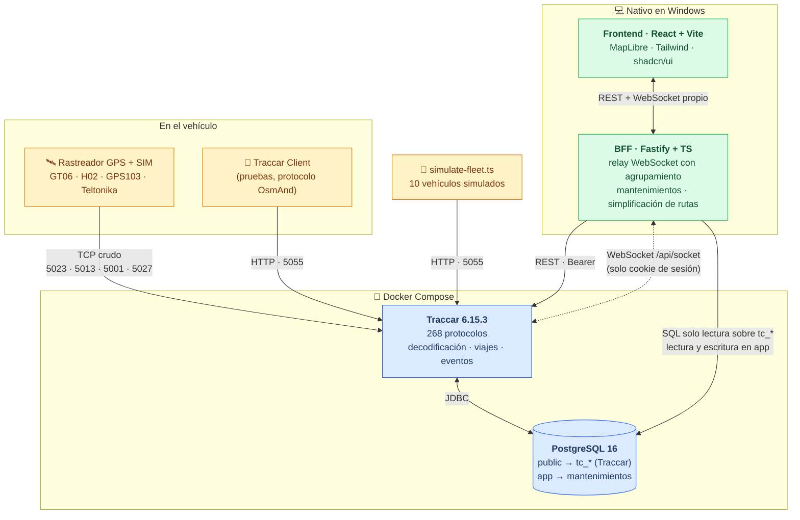

# rastreo-propio

**Plataforma autoalojada de rastreo GPS vehicular.** Sustituye una plataforma
comercial de suscripción por una propia para monitorear una flota de 10 vehículos,
con un módulo de mantenimientos a la medida y un frontend construido desde cero
sobre [Traccar](https://www.traccar.org/) como motor de ingesta.

> 🇬🇧 **In English** — Self-hosted GPS fleet tracking platform. Replaces a paid
> subscription service with an owned stack: Traccar handles raw device protocol
> ingestion (268 protocols), while a custom Fastify BFF and React frontend provide
> live fleet mapping, trip history, and a maintenance-scheduling module that tracks
> service intervals by odometer, date, and engine hours. Spanish documentation.

<!-- TODO(capturas): reemplazar por una captura real del mapa en vivo con la flota
     simulada. Tamaño sugerido 1280x720, en docs/img/mapa-en-vivo.png -->
<!--  -->

<!-- TODO(gif): GIF de 10-15 s mostrando las unidades moviéndose y el panel lateral
     filtrando por estado. Grabado con ScreenToGif. docs/img/demo.gif -->

---

## Stack


| Capa | Tecnología |
|---|---|
| Motor GPS | Traccar 6.15.3 (imagen oficial de Docker) |
| Base de datos | PostgreSQL 16 |
| API / BFF | Node 22 + TypeScript + Fastify |
| Frontend | React 19 + TypeScript + Vite |
| Mapas | MapLibre GL JS + tiles de OpenFreeMap |
| Estilos | Tailwind CSS + shadcn/ui |
| Gráficas | Recharts |
| Validación | Zod |
| Tests | Vitest |
| Monorepo | pnpm workspaces |
| Orquestación | Docker Compose |

---

## Arquitectura



**En verde lo que construimos.** En azul, la infraestructura que solo se
configura. La decisión de fondo — usar Traccar en vez de escribir decodificadores
de protocolos binarios — está justificada en
[ADR 0001](docs/adr/0001-motor-traccar.md).

---

## Quick Start

Requiere Windows 11 con Docker Desktop, Node 22+ y pnpm.
Guía completa: [`docs/01-instalacion-local.md`](docs/01-instalacion-local.md).

```powershell
git clone https://github.com/HackerDonA/rastreo-propio.git
cd rastreo-propio
pnpm install

# 1. Configuración (genera una contraseña y pégala en POSTGRES_PASSWORD)
Copy-Item .env.example .env
-join ((48..57) + (65..90) + (97..122) | Get-Random -Count 32 | ForEach-Object {[char]$_})

# 2. Traccar + PostgreSQL
pnpm infra:up
pnpm infra:ps          # espera a ver (healthy) en los dos

# 3. Crea tu administrador (el primer usuario se vuelve admin automáticamente)
#    y genera el token en http://localhost:8082 → Cuenta → Token
#    Pégalo en .env como TRACCAR_API_TOKEN

# 4. API + frontend
pnpm dev

# 5. En otra terminal: 10 vehículos simulados
pnpm simulate --units 10 --city cdmx
```

Abre <http://localhost:5173> y verás la flota moviéndose.

---

## Funcionalidades

**Infraestructura**
- [x] Docker Compose con Traccar 6.15.3 + PostgreSQL 16, healthchecks y volúmenes con nombre
- [x] Configuración sin secretos en el repositorio (credenciales por variables de entorno)
- [x] Filtros de entrada para no almacenar posiciones inválidas, duplicadas o en 0,0
- [x] Puertos de protocolo documentados equipo por equipo

**Simulación y desarrollo**
- [x] Simulador de 10+ vehículos con rutas realistas, paradas y arranques
- [x] Rutas precargadas de CDMX, Monterrey y Guadalajara (funciona sin internet)
- [x] Alta automática de las unidades simuladas vía API de Traccar

**API / BFF**
- [x] Cliente tipado de Traccar con bootstrap de sesión para el WebSocket
- [x] Relay de WebSocket con agrupamiento de emisiones (10× menos mensajes)
- [x] `GET /api/units` — flota completa con última posición, en una sola llamada
- [x] `GET /api/units/:id/history` — con simplificación Douglas-Peucker
- [x] `GET /api/units/:id/trips` — viajes detectados por Traccar
- [x] `GET /api/fleet/summary` — kilómetros del día y unidades activas
- [ ] Módulo de mantenimientos (CRUD + plantillas + job horario)

**Frontend**
- [x] Mapa en vivo con agrupamiento de marcadores y rumbo
- [x] Panel lateral con buscador, filtro por estado y orden configurable
- [x] Indicadores de flota en la barra superior
- [x] Ficha de detalle de la unidad seleccionada
- [x] Modo claro y oscuro, y diseño responsivo
- [x] Estados de carga, vacío y error resueltos
- [ ] Vista de historial con selector de rango de fechas
- [ ] Vista de mantenimientos con barras de progreso

**Operación**
- [x] ADRs de las decisiones de arquitectura
- [x] Pruebas de las conversiones de unidades y la simplificación de rutas
- [ ] Scripts de respaldo y restauración (PowerShell y Bash)
- [ ] CI con lint, typecheck, tests y build
- [ ] Guía de migración a producción (Raspberry Pi / VPS)

---

## Documentación

| Documento | De qué trata |
|---|---|
| [01 · Instalación local](docs/01-instalacion-local.md) | Paso a paso en Windows 11, con la sección de firewall, IP local y puertos reservados |
| [02 · Conectar mis GPS](docs/02-conectar-mis-gps.md) | Identificar el protocolo de un rastreador, configurarlo por SMS, y migrar desde Ruhavik |
| [03 · Arquitectura](docs/03-arquitectura.md) | Flujo de datos, modelo del esquema `app`, volumen de datos esperado |
| [04 · Migrar a producción](docs/04-migrar-a-produccion.md) | DDNS, port forwarding, HTTPS con Caddy, respaldos |

---

## Decisiones técnicas

Cada decisión no obvia está documentada con su contexto, sus motivos y lo que
descartamos. Es la parte del repositorio que más dice sobre cómo se pensó.

| ADR | Decisión | El punto clave |
|---|---|---|
| [0001](docs/adr/0001-motor-traccar.md) | Traccar como motor, no un servidor propio | 268 protocolos binarios sin documentación oficial. Reimplementarlos no acerca al objetivo. |
| [0002](docs/adr/0002-bff-propio.md) | Un BFF entre el frontend y Traccar | El WebSocket de Traccar **solo** acepta cookie de sesión, no token. Sin BFF, no hay tiempo real. |
| [0003](docs/adr/0003-maplibre-openfreemap.md) | MapLibre + OpenFreeMap | Un panel de rastreo abierto todo el día es el peor caso para un mapa que cobra por carga. |
| [0004](docs/adr/0004-schema-app-separado.md) | Esquema `app` separado, misma base | Traccar migra su esquema solo en cada arranque. Separar permite actualizarlo sin miedo. |

---

## Qué aprendí construyéndolo

<!-- Se va llenando conforme avanzan las fases. -->

**La documentación de un proyecto vivo envejece más rápido que su código.** Tres
cosas que "todo el mundo sabe" sobre Traccar resultaron falsas en la versión
6.15, y las tres se verificaron leyendo el código fuente en vez de tutoriales:

- `conf/default.xml` **ya no existe**. Los 268 puertos por omisión están
  compilados en `PortConfigSuffix.java`.
- `database.historyDays` **fue eliminado**. Hoy Traccar no tiene ninguna opción de
  retención automática de historial.
- Un protocolo **solo arranca si su puerto está configurado**
  (`ServerManager.java`), aunque el valor venga de un default en código.

**Una restricción de autenticación puede decidir toda una arquitectura.** El
WebSocket de Traccar no acepta el token de API, solo una cookie de sesión. Ese
detalle, y no una preferencia de diseño, es lo que hace obligatorio el BFF: un
navegador no puede inyectar la cookie de otro origen en un WebSocket.

**XML prohíbe dos guiones seguidos dentro de un comentario.** Un separador
`-----` en `traccar.xml` deja el contenedor en bucle de reinicio con un
`SAXParseException` que no menciona la línea culpable. Costó un rato encontrarlo.

**Las unidades importan más que los tipos.** Traccar guarda toda velocidad en
**nudos**, incluido el parámetro `speed` del protocolo OsmAnd. TypeScript no te
salva de mandar 60 creyendo que son km/h cuando el servidor entiende 111. Por eso
las conversiones viven en funciones puras con pruebas: un error ahí no lanza
ninguna excepción, solo muestra un número equivocado que nadie nota.

**Un mensaje de error genérico puede ser una decisión de seguridad.** Traccar
responde `HTTP 400 · Unknown device` a cualquier identificador que no conozca, y
la tentación es apagar esa validación con `database.registerUnknown`. Pero eso
significa que cualquiera que alcance el puerto puede crear unidades en tu
servidor. La salida correcta fue que el simulador registre las suyas por la API.

**El estado que se muestra casi nunca es el estado que devuelve la API.**
Traccar distingue `online`/`offline`, pero para quien mira la pantalla un
vehículo conectado y detenido no es lo mismo que uno circulando, y uno que
Traccar cree conectado pero lleva media hora sin fix es un tercer caso. El estado
útil se deriva de la velocidad y de la antigüedad del último reporte.

**Agrupar mensajes no es optimización prematura cuando el reloj no lo decides
tú.** Diez unidades reportando cada segundo son diez mensajes por segundo *por
navegador abierto*. El relay los acumula en un buffer indexado por unidad y lo
vacía cada 750 ms: medido, 3.3 posiciones/s de entrada se convierten en 0.33
mensajes/s de salida, sin perder un solo dato.

---

## Licencia

[MIT](LICENSE)

Mapas © [OpenFreeMap](https://openfreemap.org/) ·
[OpenMapTiles](https://openmaptiles.org/) ·
[OpenStreetMap](https://www.openstreetmap.org/copyright)
