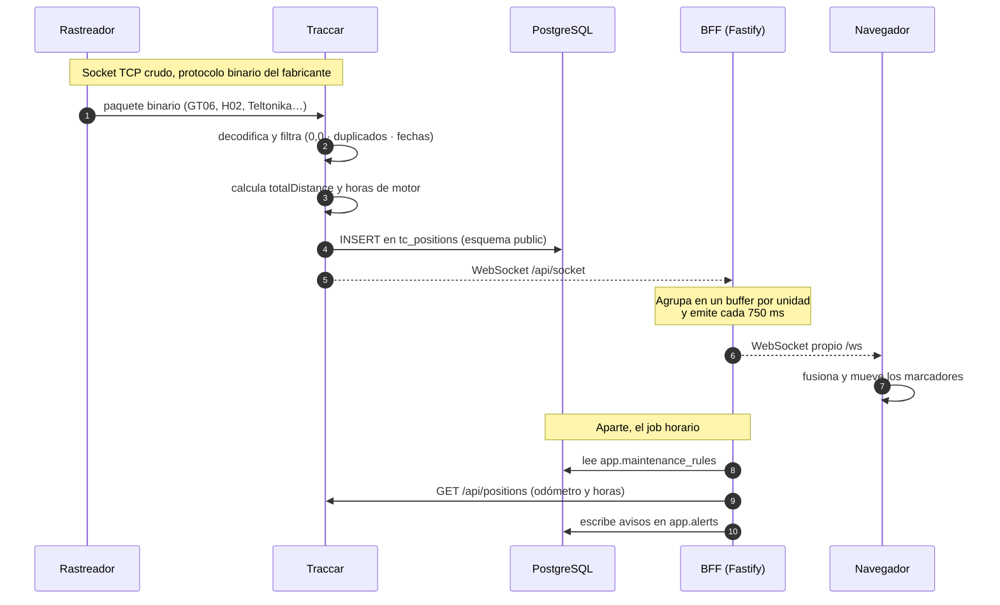
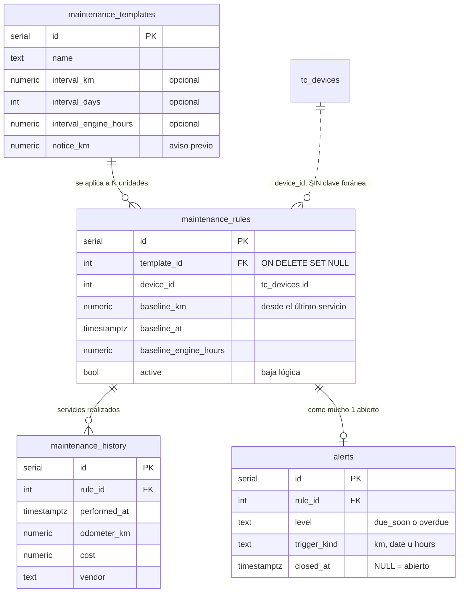

# 03 · Arquitectura

Cómo fluye un dato desde el rastreador hasta la pantalla, y por qué está armado
así.

---

## El flujo completo



## Los tres saltos que definen el diseño

### 1. El rastreador habla TCP crudo, no HTTP

Un GT06 abre un socket y manda bytes. No entiende HTTP, ni TLS, ni
redirecciones. Por eso:

- **Ningún proxy inverso sirve** para ese tráfico. Caddy es solo para el
  frontend y la API.
- **Cloudflare Tunnel y Tailscale no sirven** para exponer los puertos de
  protocolo. Detalle en
  [`02-conectar-mis-gps.md`](02-conectar-mis-gps.md#h-que-un-rastreador-real-llegue-a-mi-máquina).
- El puerto de protocolo tiene que llegar al contenedor por reenvío directo.

### 2. El WebSocket de Traccar solo acepta cookie

La restricción que hace obligatorio el BFF. La documentación oficial lo dice
textual: *"Session cookie is the only authorization option for the WebSocket
connection."*

Un navegador **no puede** adjuntar una cookie de otro origen a un handshake de
WebSocket. El BFF sí, porque es un cliente HTTP normal:

1. `GET /api/session?token=<token>` para obtener `JSESSIONID`
2. Abre `/api/socket` con esa cookie
3. Reparte a todos los navegadores por su propio `/ws`

Ver [ADR 0002](adr/0002-bff-propio.md).

### 3. El agrupamiento no es opcional cuando el reloj no lo decides tú

Diez unidades reportando cada segundo son diez mensajes por segundo **por cada
navegador abierto**. El relay las acumula en un `Map` indexado por unidad y lo
vacía cada `WS_FLUSH_INTERVAL_MS` (750 ms por omisión).

Si una unidad reporta dos veces dentro de la misma ventana solo se manda la
última, que es la única que el mapa necesita.

**Medido contra el simulador:** 3.3 posiciones/s de entrada producen
**0.33 mensajes/s** de salida por navegador. Diez veces menos, sin perder un
solo dato.

---

## Modelo de datos del esquema `app`



### Decisiones que viven en el esquema, no en el código

**Sin claves foráneas hacia `public`.** `maintenance_rules.device_id` apunta a
`tc_devices.id` pero sin `FOREIGN KEY`. Dos motivos: una FK hacia un esquema que
no controlamos se rompe cuando Traccar altera esa tabla; y `tc_devices` tiene
`ON DELETE CASCADE` hacia `tc_positions`, así que borrar una unidad en Traccar
se llevaría en silencio su historial de servicios — justo el dato que conviene
conservar aunque el vehículo salga de la flota.

**Índice único parcial sobre `alerts (rule_id) WHERE closed_at IS NULL`.** Como
mucho un aviso abierto por regla. Sin él, el job horario insertaría uno nuevo
cada hora y en una semana habría 168 avisos del mismo cambio de aceite.

**Índice único sobre `maintenance_rules (device_id, template_id)`.** Hace que
aplicar una plantilla a la flota sea idempotente: presionarlo dos veces no
duplica reglas.

**`CHECK` de que toda plantilla tenga al menos un intervalo.** Una regla sin
ningún intervalo nunca vencería; la base lo rechaza.

**Baja lógica (`active`), no `DELETE`.** Borrar una regla arrastraría su
historial de servicios por cascada, y eso es lo más caro de reconstruir.

---

## La regla de "lo que ocurra primero"

Una regla puede medir en tres dimensiones a la vez: kilómetros, días y horas de
motor. *"Aceite cada 5,000 km o cada 6 meses, lo que ocurra primero"* es el caso
normal, no la excepción.

Para compararlas se calcula el **avance** de cada una — la fracción del intervalo
ya consumida — y gana la más avanzada, que es la que vencerá antes. El avance es
adimensional, y eso es lo que permite comparar kilómetros contra días.

```
avance = consumido / intervalo

km     : (odómetro_actual  −  baseline_km)     / interval_km
fecha  : (ahora − baseline_at) en días         / interval_days
horas  : (horas_actuales  −  baseline_hours)   / interval_engine_hours
```

Que falte un dato desactiva **solo su dimensión**. Una regla por kilómetros y
fecha debe seguir venciendo por fecha aunque la unidad nunca haya reportado
odómetro: el tiempo pasa igual para un vehículo parado.

La implementación son funciones puras en
[`evaluate.ts`](../apps/api/src/modules/maintenance/evaluate.ts) — sin base de
datos, sin reloj, sin Traccar. Es código cuyos fallos son silenciosos (avisa
tarde, o avisa de más, pero nunca lanza una excepción), así que tenía que ser
fácil de probar.

---

## Simplificación del historial

Un mes de una unidad reportando cada 15 segundos son **~170,000 puntos**.
Mandarlos al navegador son varios megabytes de JSON para dibujar una línea que a
simple vista es idéntica con 2,000 puntos.

`GET /api/units/:id/history` aplica **Ramer-Douglas-Peucker**, que conserva la
*forma* del recorrido: mantiene los puntos donde la ruta cambia de dirección y
descarta los que caen sobre una recta. Un tramo de carretera de 20 km sin curvas
se reduce a dos puntos; una glorieta conserva todos los suyos.

> Un muestreo uniforme (uno de cada N) sería más simple y mucho peor: puede
> borrar justo la curva cerrada y conservar diez puntos de una recta.

La distancia y la velocidad máxima se calculan sobre los puntos **completos**,
antes de simplificar. Medirlas después daría kilómetros de menos.

Este endpoint lee `tc_positions` **directo por SQL** en vez de pasar por la API
de Traccar, que corta en `report.maxPositions` (50,000 por omisión).

---

## Volumen de datos esperado

Con **10 unidades reportando cada 15 segundos**:

| Periodo | Filas en `tc_positions` |
|---|---|
| Por unidad, por día | 5,760 |
| Flota, por día | 57,600 |
| Flota, por mes | **~1.7 millones** |
| Flota, por año | ~21 millones (≈ 6–8 GB con atributos e índices) |

PostgreSQL maneja eso sin esfuerzo. Traccar ya crea el índice
`position_deviceid_fixtime` sobre `tc_positions`
([`changelog-4.7.xml`](https://github.com/traccar/traccar/blob/master/schema/changelog-4.7.xml)),
que es exactamente el que necesitan las consultas de historial — por eso este
proyecto **no agrega ningún índice** a las tablas `tc_*`.

**Cuándo preocuparse:** cuando ocurra lo primero de

- ~50–100 millones de filas en `tc_positions`, o
- una consulta de historial de un mes tarde más de ~1 segundo.

Con 10 unidades eso son entre 2 y 4 años de operación. En ese punto hay dos
caminos: particionar `tc_positions` por mes, o migrar a TimescaleDB (Traccar
publica un `docker-compose` de ejemplo para eso).

### Retención

> `database.historyDays` **ya no existe** en Traccar 6.15 — fue eliminada, y hoy
> el servidor no tiene ninguna opción de retención automática. Verificado contra
> [`Keys.java`](https://github.com/traccar/traccar/blob/master/src/main/java/org/traccar/config/Keys.java).

La estrategia es de dos partes:

1. **No guardar basura.** Los filtros de
   [`infra/traccar.xml`](../infra/traccar.xml) descartan coordenadas 0,0,
   posiciones inválidas, duplicados y fechas fuera de rango **antes** de
   escribir. Es lo que de verdad controla el crecimiento: una posición inválida
   ocupa lo mismo que una buena y no sirve para nada.
2. **Purga manual opcional**, respetando la última posición de cada unidad. No
   viene automatizada a propósito: borrar historial es irreversible.

---

## Decisiones de fondo

| ADR | Decisión |
|---|---|
| [0001](adr/0001-motor-traccar.md) | Traccar como motor, no un servidor de protocolos propio |
| [0002](adr/0002-bff-propio.md) | Un BFF entre el frontend y Traccar |
| [0003](adr/0003-maplibre-openfreemap.md) | MapLibre + OpenFreeMap |
| [0004](adr/0004-schema-app-separado.md) | Esquema `app` separado, misma base de datos |
